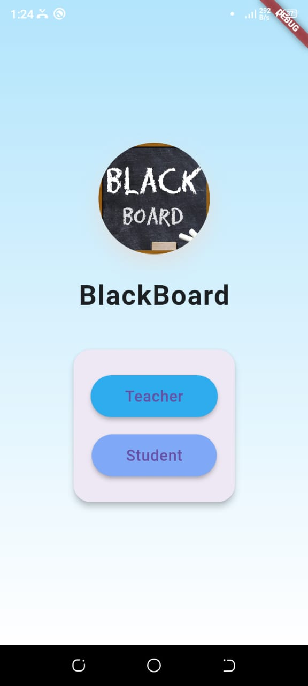
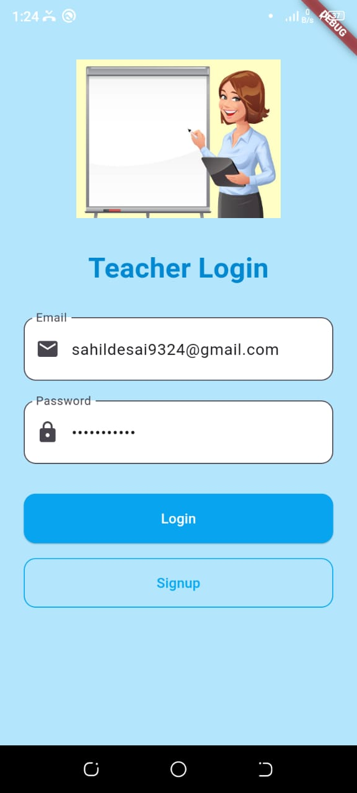
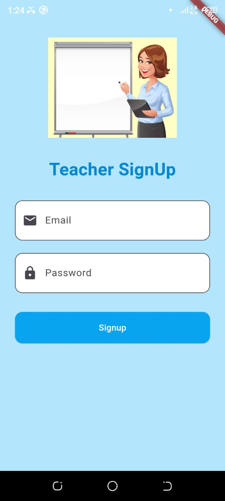
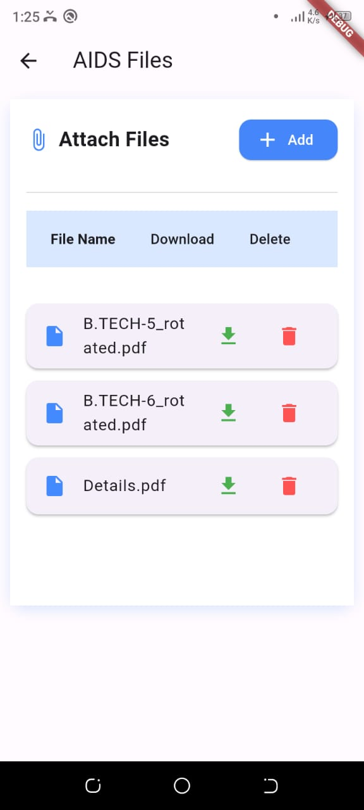
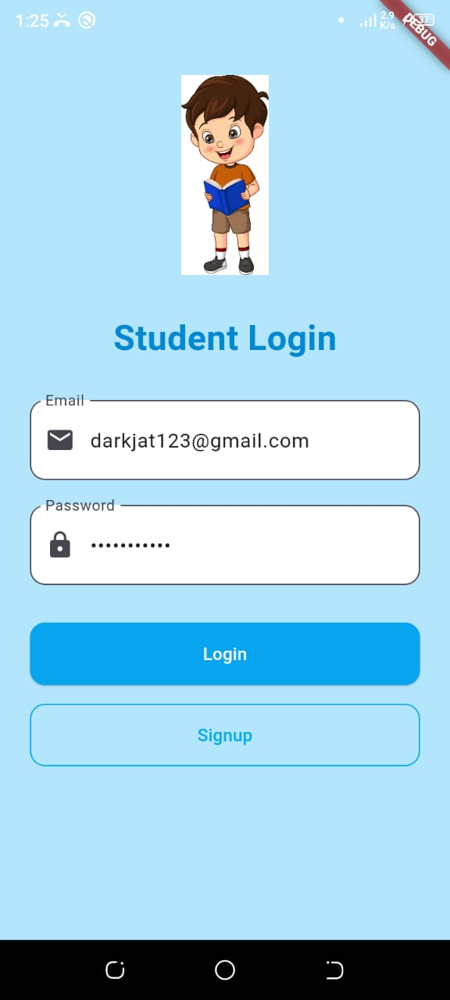
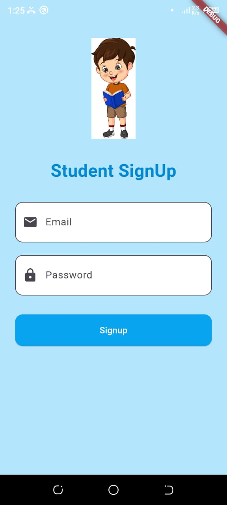
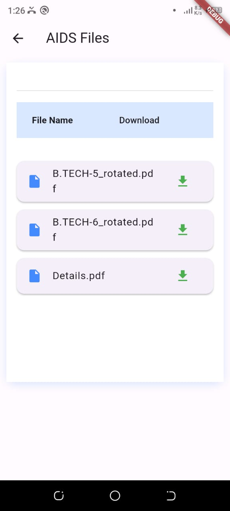
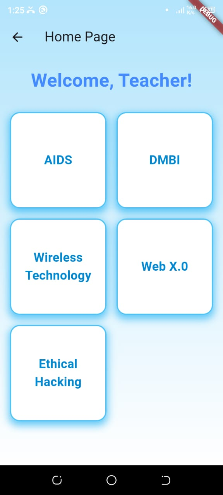

📚 Flutter Teacher-Student File Management App
A simple and efficient Flutter app that connects teachers and students through secure file sharing and management!

✨ Features
🔐 Authentication using Firebase Authentication for both teachers and students.

🧑‍🏫 Teacher Panel:

Upload files organized by subject.
Delete uploaded files when needed.

🎓 Student Panel:

View available files sorted by subjects.
Download files easily for offline access.

🔥 Technologies Used
Flutter & Dart — for a smooth, responsive mobile app experience.
Firebase — for authentication and cloud file storage.
Android Studio — for development and testing.

🚀 Key Highlights
Role-based access (Teacher/Student) for maximum control.
Clean, user-friendly UI.
Real-time file updates through Firebase.
Secure and scalable backend powered by Firebase services.

# Main Page

# Teacher Pages

  
  
  

# Student Pages

  
  
  

# Home Pages

  
  

# Files Page

  
  

